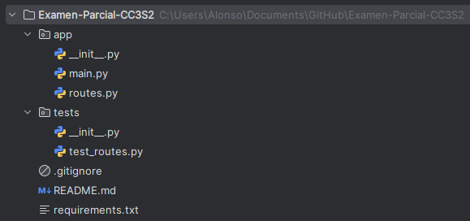
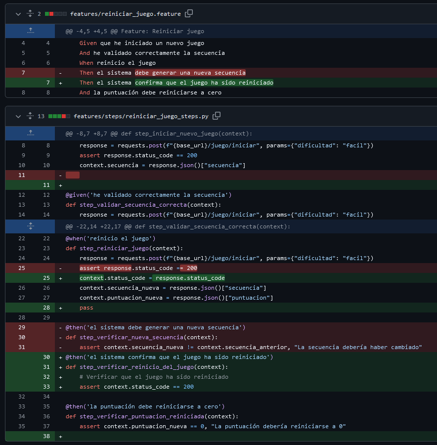
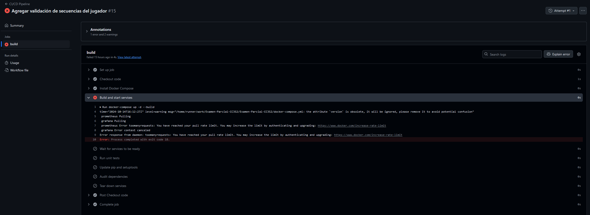

# En este documento se detalla todo lo realizado por el alumno: Jorge Alonso Barriga Morales  
## **1. Distribución de tareas**

Siguiendo las indicaciones del examen parcial, la distribución de tareas se realizó de manera equitativa entre los miembros del equipo. A mí se me asignó la responsabilidad de desarrollar la **lógica de validación de secuencias del jugador** como **Miembro 2**, además de contribuir en tareas adicionales que detallaremos más adelante. El reparto de tareas fue planificado de modo que todos los miembros pudieran trabajar de manera efectiva en diferentes aspectos del proyecto, intentando que sea lo más balanceado posible.
## **2. Mi rol en el equipo**

Me encargué de liderar el **Sprint 1**, implementando la configuración inicial del proyecto, incluyendo la integración de Docker, Prometheus y CI/CD, así como la estructura de la aplicación utilizando **FastAPI**. En el **Sprint 2**, participé en la **validación de secuencias** y en el desarrollo de pruebas asociadas. Finalmente, en el **Sprint 3**, colaboré en la implementación de **pruebas adicionales** tanto con **Pytest** como con **Behave**, además de contribuir en la **documentación del proyecto**.

### **Explicación del Sprint 1**

Todos los commits y PRs del **Sprint 1** son de mi autoría debido a que mi compañero **Olivera** estaba a cargo de crear el **Kanban Board** mientras yo trabajaba en las configuraciones iniciales del proyecto. Dado que los tres miembros del equipo **(Llanos, Olivera, Barriga)** ya habíamos trabajado juntos en un proyecto grupal anterior, estaba familiarizado con las herramientas y las configuraciones que desarrollamos en equipo previamente. Esto me permitió reutilizar esas configuraciones de manera eficiente. Esta decisión fue clave para ahorrar tiempo y permitir que, desde el **Sprint 2**, pudiéramos concentrarnos en desarrollar el juego sobre una infraestructura ya establecida y funcional.
### **Responsabilidades específicas:**
- Configuración inicial de la estructura y arquitectura del proyecto con **FastAPI**.
- Contenerización del proyecto con **Docker** y orquestación con **Docker Compose**.
- Configurar el monitoreo básico con **Prometheus**.
- Implementar un **pipeline de CI/CD** utilizando **GitHub Actions** para pruebas y auditoría automática.
- Desarrollar la lógica de **validación de secuencias** y crear las pruebas unitarias y BDD correspondientes.
- Apoyar en la implementación de pruebas adicionales y la documentación del proyecto.

## **3. Aportes realizados por sprint**

### **3.1. Sprint 1: Configuración e Infraestructura**
Durante el **Sprint 1**, me encargué de configurar la estructura y las herramientas principales del proyecto.

1. **Crear la estructura básica del proyecto**:
   - Implementé la estructura del proyecto, integrando **FastAPI** como framework para los endpoints.
   - Se crearon las carpetas necesarias para los archivos de la aplicación (`app/`) y las pruebas (`tests/`).
   - Se añadió el archivo `routes.py` para los primeros endpoints, `main.py` para inicializar la aplicación y `test_routes.py` para pruebas unitarias.
   - **PR asociado**: [Añadir estructura básica del proyecto (#1)](https://github.com/Renato200419/Examen-Parcial-CC3S2/pull/1).
   - **Rama asociada**: `feature/basic-structure`

	    
   * **routes.py**:
		```python
		from fastapi import APIRouter  
		  
		# Crear el enrutador de FastAPI  
		router = APIRouter()  
		  
		# Rutas de la API  
		  
		# Ruta principal  
		@router.get("/")  
		def root():  
		    return {"message": "Bienvenido a la app!"}  
		  
		# Ruta de verificación de salud  
		@router.get("/health")  
		def health_check():  
		    return {"status": "healthy"}
		```
   * **test_routes.py**:
		```python
		from fastapi.testclient import TestClient  
		from app.main import app  
		  
		client = TestClient(app)  
		  
		def test_root():  
		    response = client.get("/")  
		    assert response.status_code == 200  
		    assert response.json() == {"message": "Aplicación para Simon Says"}  
		  
		def test_health_check():  
		    response = client.get("/health")  
		    assert response.status_code == 200  
		    assert response.json() == {"status": "healthy"}
		```
   * **main.py**:
		```python
		from fastapi import FastAPI  
		from app.routes import router as app_router  
		import uvicorn  
		app = FastAPI()  
		  
		# Incluir las rutas  
		app.include_router(app_router)  
		  
		if __name__ == "__main__":  
		    uvicorn.run(app, host="0.0.0.0", port=8000)
		```
1. **Configurar Prometheus para monitoreo básico**:
   - Implementé el archivo `prometheus.yml` para habilitar el monitoreo básico con **Prometheus**.
   - **PR asociado**: [Agregar archivo prometheus.yml para configuración de monitoreo (#2)](https://github.com/Renato200419/Examen-Parcial-CC3S2/pull/2).
   - **Rama asociada**: `feature/prometheus`
   - **prometheus.yml**:
		```yml
		global:  
		  scrape_interval: 15s  # Define cada cuánto Prometheus raspa datos de los targets  
		  
		scrape_configs:  
		  - job_name: 'py-app'  # Nombre del trabajo  
		    static_configs:  
		      - targets: ['app:8000']  # Lista de direcciones y puertos de los targets
		```

2. **Contenerización del proyecto con Docker**:
   - Creé los archivos `Dockerfile` y `docker-compose.yml` para contenerizar y orquestar la aplicación.
   - Esto permitió que la aplicación pudiera ser desplegada fácilmente en cualquier entorno.
   - **PR asociado**: [Agregar Dockerfile y docker-compose.yml para contenerización y orquestación (#3)](https://github.com/Renato200419/Examen-Parcial-CC3S2/pull/3).
   - **Rama asociada**: `feature/docker-integration`
   - **Dockerfile**:
		```dockerfile
		FROM python:3.8  
		  
		# Crear directorio de la app y copiar todo el contenido  
		WORKDIR /app  
		  
		# Copiar el contenido del directorio actual a /app en el contenedor  
		COPY . /app  
		  
		# Instalar las dependencias  
		RUN pip install --no-cache-dir -r requirements.txt  
		  
		# Exponer el puerto  
		EXPOSE 8000  
		  
		# Ejecutar la aplicación con Uvicorn  
		CMD ["uvicorn", "app.main:app", "--host", "0.0.0.0", "--port", "8000", "--reload"]
		```
   - **docker-compose.yml**:
		```yml
		version: '3.8'  
		  
		services:  
		  app:  
		    build: .  # Construye la imagen desde el Dockerfile en el directorio actual  
		    ports:  
		      - "8000:8000"  # Mapea el puerto 8000 del contenedor al puerto 8000 del host  
		    volumes:  
		      - .:/app  # Monta el directorio actual en /app dentro del contenedor  
		    healthcheck:  
		      test: ["CMD", "curl", "-f", "http://localhost:8000/health"]  
		      interval: 10s  
		      timeout: 10s  
		      retries: 5  
		      start_period: 30s  
		  
		  prometheus:  
		    image: prom/prometheus  # Utiliza la imagen oficial de Prometheus  
		    volumes:  
		      - ./prometheus.yml:/etc/prometheus/prometheus.yml  # Monta el archivo de configuración de Prometheus  
		      - prometheus_data:/prometheus  # Volumen persistente para los datos de Prometheus  
		    ports:  
		      - "9090:9090"  # Mapea el puerto 9090 del contenedor al puerto 9090 del host  
		    depends_on:  
		      app:  
		        condition: service_healthy  # Espera hasta que el servicio 'app' esté en estado 'healthy'  
		    healthcheck:  
		      test: ["CMD-SHELL", "wget --spider --quiet http://localhost:9090/-/healthy || exit 1"]  
		      interval: 30s  
		      timeout: 10s  
		      retries: 3  
		      start_period: 30s  
		  
		  grafana:  
		    image: grafana/grafana  # Utiliza la imagen oficial de Grafana  
		    volumes:  
		      - grafana_data:/var/lib/grafana  # Volumen persistente para los datos de Grafana  
		    ports:  
		      - "3000:3000"  # Mapea el puerto 3000 del contenedor al puerto 3000 del host  
		    depends_on:  
		      prometheus:  
		        condition: service_healthy  # Espera hasta que Prometheus esté en estado 'healthy'  
		    environment:  
		      - GF_USERS_ALLOW_SIGN_UP=false  # Desactiva el registro de nuevos usuarios  
		  
		volumes:  
		  prometheus_data:  # Definir el volumen persistente para Prometheus  
		  grafana_data:  # Definir el volumen persistente para Grafana
		```

3. **Configurar el pipeline de CI/CD**:
   - Implementé un pipeline de **CI/CD** con **GitHub Actions** que automatiza el proceso de pruebas y auditorías.
   - Configuré la ejecución de pruebas unitarias con `pytest` y la auditoría de dependencias para mejorar la seguridad del código.
   - **PR asociado**: [Agregar configuración de pipeline CI/CD con Docker y pruebas unitarias (#5)](https://github.com/Renato200419/Examen-Parcial-CC3S2/pull/5).
   - **Rama asociada**: `feature/pipeline`
   - **ci.yml**:
		```yml
		name: CI/CD Pipeline  
		  
		on:  
		  push:  
		    branches:  
		      - main  
		      - develop  
		  pull_request:  
		    branches:  
		      - main  
		      - develop  
		  
		jobs:  
		  build:  
		    runs-on: ubuntu-latest  
		  
		    steps:  
		      - name: Checkout code  
		        uses: actions/checkout@v2  
		  
		      - name: Install Docker Compose  
		        run: |  
		          sudo curl -L "https://github.com/docker/compose/releases/download/$(curl -s https://api.github.com/repos/docker/compose/releases/latest | grep tag_name | cut -d '"' -f 4)/docker-compose-$(uname -s)-$(uname -m)" -o /usr/local/bin/docker-compose  
		          sudo chmod +x /usr/local/bin/docker-compose  
		          docker-compose version  
		  
		      - name: Build and start services  
		        run: |  
		          docker-compose up -d --build  
		  
		      - name: Wait for services to be ready  
		        run: |  
		          echo "Waiting for services to be ready..."  
		          for i in {1..30}; do  
		            if docker-compose exec app curl -s http://localhost:8000/; then  
		              echo "Services are ready!"  
		              break  
		            else  
		              echo "Waiting for services to be ready..."  
		              sleep 5  
		            fi  
		          done  
		          if [ $i -eq 30 ]; then  
		            echo "Application did not start in time"  
		            exit 1  
		          fi  
		  
		      #- name: Run Behave tests  
		        #run: |          #docker-compose exec app behave  
		      - name: Run unit tests  
		        run: |  
		          docker-compose exec app pytest tests/  
		  
		      - name: Update pip and setuptools  
		        run: |  
		          docker-compose exec app pip install --upgrade pip setuptools  
		  
		      - name: Audit dependencies  
		        run: |  
		          docker-compose exec app pip install pip-audit  
		          docker-compose exec app pip-audit  
		  
		      - name: Tear down services  
		        run: |  
		          docker-compose down
		```

### **3.2. Sprint 2: Validación de Secuencias**
En el **Sprint 2**, me enfoqué en la lógica de validación de secuencias y en las pruebas asociadas, además de colaborar en la implementación de la consola interactiva.

1. **Validación de secuencias del jugador**:
   - Implementé la clase `ValidadorSecuencias` para comparar la secuencia generada por el sistema con la ingresada por el jugador.
		```python
		class ValidadorSecuencias:  
		    def __init__(self, secuencia_generada):  
		        self.secuencia_generada = secuencia_generada  
		  
		    def validar_secuencia(self, secuencia_jugador):  
		        """Compara la secuencia del jugador con la generada"""  
		        return self.secuencia_generada == secuencia_jugador
		```
   - Se creó el endpoint `/juego/validar` para manejar la validación de las secuencias ingresadas.
		```python
		@router.post("/juego/validar")  
		def validar_secuencia(secuencia_jugador: list[str]):  
		    """Válida la secuencia del jugador"""  
		    global secuencia_actual  
		    validador = ValidadorSecuencias(secuencia_actual)  
		    es_valida = validador.validar_secuencia(secuencia_jugador)  
		    if not es_valida:  
		        raise HTTPException(status_code=400, detail="Secuencia incorrecta. Juego terminado.")  
		    return {"mensaje": "Secuencia correcta, continúa", "secuencia": secuencia_actual}
		```
   - Se cambia la versión de python a 3.9 en `Dockerfile`
		```dockerfile
		FROM python:3.9
		```
   - **PR asociado**: [Agregar validación de secuencias del jugador (#15)](https://github.com/Renato200419/Examen-Parcial-CC3S2/pull/15).
   - **Rama asociada**: `feature/Barriga-validacion_y_secuencias`


2. **Pruebas BDD para la validación de secuencias**:
   - Añadí pruebas **BDD** con **Behave** para validar las secuencias correctas e incorrectas, asegurando que el juego funcione correctamente.
   - **PR asociado**: [Añadir pruebas BDD para la validación de secuencias (#18)](https://github.com/Renato200419/Examen-Parcial-CC3S2/pull/18).
   - **Rama asociada**: `feature/Barriga-BDD-validacion`
   - **validar_secuencia.feature**:
		```
		Feature: Validación de secuencias ingresadas por el jugador  
		  Como desarrollador,  
		  Quiero implementar la validación de secuencias,  
		  Para verificar que el jugador repita correctamente la secuencia generada y avanzar o finalizar el juego.  
		  
		  Scenario: Validación exitosa de la secuencia  
		    Given que el sistema ha generado una secuencia  
		    When el jugador ingresa la secuencia correcta  
		    Then el sistema confirma que la secuencia es correcta y el jugador continúa  
		  
		  Scenario: Validación fallida de la secuencia  
		    Given que el sistema ha generado una secuencia  
		    When el jugador ingresa una secuencia incorrecta  
		    Then el sistema notifica que la secuencia es incorrecta y el juego termina
		```
   - **validar_secuencia_steps.py**:
		```python
		from behave import *  
		from app.validation import ValidadorSecuencias  
		  
		@given('que el sistema ha generado una secuencia')  
		def step_generar_secuencia(context):  
		    context.secuencia_generada = ['rojo', 'verde', 'azul']  # Ejemplo de secuencia generada  
		    context.validador = ValidadorSecuencias(context.secuencia_generada)  
		  
		@when('el jugador ingresa la secuencia correcta')  
		def step_ingresar_secuencia_correcta(context):  
		    context.secuencia_jugador = ['rojo', 'verde', 'azul']  # El jugador repite correctamente la secuencia  
		    context.resultado = context.validador.validar_secuencia(context.secuencia_jugador)  
		  
		@then('el sistema confirma que la secuencia es correcta y el jugador continúa')  
		def step_verificar_secuencia_correcta(context):  
		    assert context.resultado is True, "La secuencia debería ser correcta"  
		  
		@when('el jugador ingresa una secuencia incorrecta')  
		def step_ingresar_secuencia_incorrecta(context):  
		    context.secuencia_jugador = ['rojo', 'amarillo', 'azul']  # El jugador ingresa una secuencia incorrecta  
		    context.resultado = context.validador.validar_secuencia(context.secuencia_jugador)  
		  
		@then('el sistema notifica que la secuencia es incorrecta y el juego termina')  
		def step_verificar_secuencia_incorrecta(context):  
		    assert context.resultado is False, "La secuencia debería ser incorrecta"
		```

3. **Pruebas unitarias para la validación de secuencias**:
   - Escribí pruebas **unitarias** en `pytest` para validar tres casos principales: secuencias correctas, incorrectas y vacías.
		```python
		# Prueba para validar que la secuencia es correcta  
		def test_validar_secuencia_correcta():  
		    secuencia_generada = ['rojo', 'verde', 'azul']  # Secuencia generada por el sistema  
		    validador = ValidadorSecuencias(secuencia_generada)  
		  
		    secuencia_jugador = ['rojo', 'verde', 'azul']  # Secuencia ingresada por el jugador  
		    assert validador.validar_secuencia(secuencia_jugador) is True, "La secuencia debería ser correcta"  
		  
		  
		# Prueba para validar que la secuencia es incorrecta  
		def test_validar_secuencia_incorrecta():  
		    secuencia_generada = ['rojo', 'verde', 'azul']  # Secuencia generada por el sistema  
		    validador = ValidadorSecuencias(secuencia_generada)  
		  
		    secuencia_jugador = ['rojo', 'amarillo', 'azul']  # Secuencia ingresada por el jugador que es incorrecta  
		    assert validador.validar_secuencia(secuencia_jugador) is False, "La secuencia debería ser incorrecta"  
		  
		  
		# Prueba para validar que una secuencia vacía falla  
		def test_validar_secuencia_vacia():  
		    secuencia_generada = ['rojo', 'verde', 'azul']  # Secuencia generada por el sistema  
		    validador = ValidadorSecuencias(secuencia_generada)  
		  
		    secuencia_jugador = []  # Secuencia vacía  
		    assert validador.validar_secuencia(secuencia_jugador) is False, "Una secuencia vacía no debería ser correcta"
		```
   - **PR asociado**: [Añadir pruebas unitarias para la validación de secuencias (#19)](https://github.com/Renato200419/Examen-Parcial-CC3S2/pull/19).
   - **Rama asociada**: `feature/Barriga-tests`

4. **Apoyo en la consola interactiva y endpoint para continuar el juego**:
   - Apoyé con correcciones finales de la consola interactiva y en la finalización del desarrollo del endpoint `/juego/continuar`.
		```python
		@router.post("/juego/continuar")  
		def continuar_juego():  
		    """Añade un nuevo color a la secuencia si el jugador ha acertado"""  
		    global secuencia_actual
		    # Inicio de mis cambios
		    nuevo_color = generador_secuencias.generar_secuencia(1)[0]  # Generar un nuevo color y añadirlo al final  
		    secuencia_actual.append(nuevo_color)  
		    # Fin de mis cambios
		    return {"mensaje": "Nuevo color añadido. Continúa la secuencia.", "secuencia": secuencia_actual}
		```
   - **PR asociado**: [Implementación de la consola interactiva y endpoint para continuar juego (#20)](https://github.com/Renato200419/Examen-Parcial-CC3S2/pull/20).
   - **Rama asociada**: `feature/Olivera-consola`

### **3.3. Sprint 3: Pruebas adicionales y Documentación**
En el **Sprint 3**, trabajé en la integración de pruebas adicionales y colaboré en la documentación del proyecto.

1. **Pruebas adicionales en Pytest y Behave**:
   - Desarrollé pruebas adicionales en **Pytest** y **Behave** para cubrir los escenarios de validación de secuencias vacías e incorrectas.
   - **validar_secuencia_vacia.feature**:
		```
		Feature: Validación de secuencia vacía  
		  
		  Scenario: Validar secuencia vacía  
		    Given que he iniciado un nuevo juego  
		    When envío una secuencia vacía  
		    Then el sistema devuelve un error indicando que la secuencia es incorrecta
		```
   - **validar_secuencia_vacia_steps.py**:
		```python
		base_url = "http://localhost:8000"  
		  
		@when('envío una secuencia vacía')  
		def step_enviar_secuencia_vacia(context):  
		    context.response = requests.post(f"{base_url}/juego/validar", json=[])  
		    assert context.response.status_code == 400  
		  
		@then('el sistema devuelve un error indicando que la secuencia es incorrecta')  
		def step_verificar_error_secuencia_vacia(context):  
		    assert context.response.json()["detail"] == "Secuencia incorrecta. Juego terminado."
		```
   - tests en **test_routes.py**:
		```python
		def test_validar_secuencia_incorrecta():  
		    # Iniciar el juego para obtener la secuencia  
		    response = client.post("/juego/iniciar", params={"dificultad": "facil"})  
		    assert response.status_code == 200  
		  
		    # Probar con una secuencia incorrecta  
		    secuencia_incorrecta = ["azul", "verde"]  # Asumimos que no es la secuencia correcta  
		    response = client.post("/juego/validar", json=secuencia_incorrecta)  
		    assert response.status_code == 400  
		    assert response.json()["detail"] == "Secuencia incorrecta. Juego terminado."  
		  
		def test_validar_secuencia_vacia():  
		    # Iniciar el juego para obtener la secuencia  
		    response = client.post("/juego/iniciar", params={"dificultad": "facil"})  
		    assert response.status_code == 200  
		  
		    # Probar con una secuencia vacía  
		    secuencia_vacia = []  
		    response = client.post("/juego/validar", json=secuencia_vacia)  
		    assert response.status_code == 400  # Esperamos un error de validación  
		    assert response.json()["detail"] == "Secuencia incorrecta. Juego terminado."
		```
   - **PR asociado**: [Implementación de pruebas adicionales en Pytest y Behave para validación y reinicio de juego (#33)](https://github.com/Renato200419/Examen-Parcial-CC3S2/pull/33).
   - **Rama asociada**: `feature/test-adicionales`
2. **Corrección del test reiniciar juego en Behave**
   - Hice un hotfix para solucionar un problema con un test que fallaba de forma intermitente
	
     
    - **PR asociado**: [Hotfix: Corregir validación del reinicio del juego en la rama develop (#35)](https://github.com/Renato200419/Examen-Parcial-CC3S2/pull/35)
   - **Rama asociada**: `hotfix/reiniciar-juego-validacion`
3. **Documentación del proyecto**:
   - Redacté el archivo `README.md` con las características principales del proyecto, la guía de instalación y uso, la estructura del proyecto y los integrantes.
   - **PR asociado**: [Redacción del README.md (#27)](https://github.com/Renato200419/Examen-Parcial-CC3S2/pull/27).
   - **Rama asociada**: `feature/Barriga-README`
## **4. Retos y desafíos enfrentados**
Durante el desarrollo del proyecto, se presentaron algunos desafíos técnicos y de coordinación que fue necesario superar:

1. **Gestión del tiempo y coordinación anticipada**: El examen se liberó con anticipación a la hora oficial de las 1 p.m., lo cual fue positivo, ya que permitió que algunos de nosotros pudiéramos planificar y empezar a trabajar en los primeros pasos del proyecto con suficiente tiempo. Sin embargo, un compañero no pudo participar de inmediato debido a compromisos previos, como su traslado. Esto nos llevó a planificar que el primer sprint fuera ejecutado principalmente por mí, dejando todo listo para que en el **Sprint 2** pudiéramos trabajar de manera fluida y colaborativa sobre una base sólida.
    
2. **Reutilización de configuraciones previas**: Un desafío importante fue asegurarse de que las configuraciones reutilizadas de proyectos anteriores funcionaran correctamente en este contexto. Si bien esto permitió ahorrar tiempo, fue crucial adaptarlas a las necesidades específicas de este nuevo proyecto.
    
3. **Implementación del pipeline CI/CD**: Durante la implementación del pipeline, surgió un reto técnico relacionado con los límites de extracción en Docker. Al ejecutar el pipeline, el error "too many requests" limitaba el número de descargas permitidas desde Docker Hub, lo que afectó la construcción de los servicios. Para solucionar esto, fue necesario reintentar la ejecución del pipeline varias veces hasta que se completaran las descargas. Afortunadamente, una vez que retomamos el trabajo en la Sala 3 de la UNI, el problema se resolvió y pudimos continuar sin interrupciones.

    
## **5. Conclusión**

Mi principal responsabilidad en este proyecto fue implementar la infraestructura inicial y asegurar la calidad del código mediante pruebas exhaustivas. Contribuí tanto en el desarrollo de la lógica de validación como en la integración de herramientas de monitoreo, contenerización y automatización de pruebas. Al iniciar el Sprint 2, el equipo ya contaba con una base sólida para desarrollar el juego, lo que permitió optimizar el tiempo y enfocarnos en la lógica del juego.
