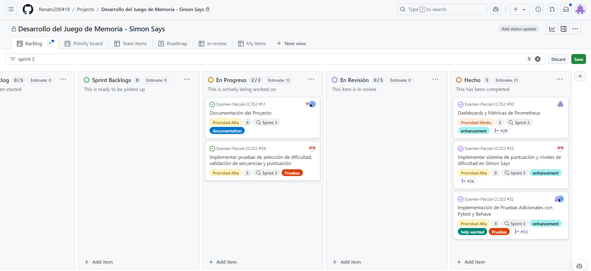

# En esta documentación se subirá todo lo realizado por el alumno: Renato Steven Olivera Calderón

## **Distribución de tareas**
De acuerdo con las indicaciones del examen parcial, la **distribución de tareas** se llevó a cabo de manera equitativa entre los integrantes del equipo. Como **Miembro 1**, se me asignó la responsabilidad de desarrollar la **implementación de la generación y gestión de secuencias**, además de colaborar en otras tareas que se detallarán más adelante. La planificación del reparto de tareas se realizó con el objetivo de que cada miembro pudiera trabajar eficientemente en distintas áreas del proyecto, buscando un balance adecuado en la carga de trabajo.

## **Mi rol en el equipo**

Fui responsable de la creación del **Kanban board** para organizar la distribución de tareas en cada sprint. 

- En el **Sprint 1**, junto con mi compañero Barriga, decidimos en la implementación de la **configuración inicial del proyecto**, que incluyó la integración de **Docker**, **Prometheus** y el pipeline de **CI/CD**, además de definir la estructura base de la aplicación utilizando **FastAPI**. 
- Durante el **Sprint 2**, participé activamente en la **generación y gestión de secuencias** y en el desarrollo de las pruebas correspondientes. 
- Finalmente, en el **Sprint 3**, colaboré en la implementación de **pruebas adicionales** utilizando **Pytest** y **Behave**, así como en la **documentación del proyecto**.

# Índice:
 - [1. Contrucción del Kanban Board](#kanban-board)
 - [2. Explicación del Sprint 1](#explicación-del-sprint-1)
 - [3. Explicación del Sprint 2](#explicación-del-sprint-2)
    - [3.1. Implementación Generación de las Secuencias](#implementación-generación-de-las-secuencias)
    - [3.2. Lógica del Juego](#lógica-de-inicio-de-juego)
    - [3.3. Creación de la interfaz consola](#interfaz-por-consola)
    - [3.3. Pruebas BDD para la generación de secuencias en el Juego](#pruebas-bdd-para-la-generación-de-secuencias-en-el-juego-simon-says)
    - [3.4. Pruebas unitarias para generar_secuencia con pytest](#pruebas-unitarias-para-generar_secuencia-con-pytest)
 - [4. Explicación del Sprint 3](#explicación-del-sprint-3)
    - [4.1. Métricas con Prometheus y Grafana](#métricas-con-prometheus-y-grafana)
    - [4.2. Test Adicionales](#agregar-test-adicionales)
 - [5. Retos y desafíos enfrentados](#retos-y-desafíos-enfrentados)
 - [6. Conclusión](#conclusión)

# Kanban Board
Un Kanban Board es una herramienta visual utilizada para gestionar y mejorar el flujo de trabajo en proyectos. Se divide en columnas que representan diferentes etapas del proceso (como "Por hacer", "En progreso" y "Hecho"). Las tareas se mueven entre columnas a medida que avanzan, lo que permite visualizar fácilmente el estado del proyecto y gestionar el trabajo de manera eficiente.

## Pasos para crear el Kanban Board
1. En la sección de `Projects` se crea el Kanban Board la cual se nombró: `Desarrollo del Juego de Memoria - Simon Says`


Luego de crearlo, se divide por columnas:
- **Product Backlog**: Contiene todas las tareas pendientes y no priorizadas del producto, es decir es el repositorio de trabajo por hacer que aún no ha sido planificado en un sprint.
- **Sprint Backlogs**: Lista de tareas seleccionadas para ser completadas en el sprint actual.
- **En progreso**: Tareas en las que el equipo está trabajando activamente.
- **En revisión**: Indica que hay pull requests abiertas que están siendo revisadas.
- **Hecho**: Significa que las pull requests ya han sido revisadas y mergeadas a la rama (`develop`).


2. Luego creamos el **template para las historias de usuario**.

- Para realizarlo nos dirigimos a `Settings` de nuestro repositorio y seleccionamos `Set up templates`.


- Luego añadimos el template.


- Seleccionamos como opción `Custom template`.


- Hacemos clic en `Preview and edit`.


- Luego damos clic en el `lapicito`.


- Luego rellenamos los tres campos.


- Una vez rellenado de la siguiente manera:


- Damos clic en `Propose changes`


- Realizamos el commit 


- En nuestra carpeta `.github` vemos que se ha creado una carpeta llamada `ISSUE_TEMPLATE` en la cual se guardan todos los templates.


- Al entrar a la carpeta tenemos nuestro template para las historias de usuario.


3. Una vez hecho el **template de las historias de usuario**, realizamos las historias de usuario.

- Las historias de usuario describen funcionalidades desde el punto de vista del usuario y expresan lo que el sistema debe hacer de manera sencilla y clara.

- Tenemos como ejemplo a la historia de usuario `Crear la estructura básica del proyecto`.

```md
**Como** desarrollador,  
**Quiero** crear la estructura básica del proyecto,  
**Para** organizar correctamente los archivos y directorios para un desarrollo escalable.

### Descripción:
El proyecto debe tener una estructura inicial que incluya carpetas para la aplicación principal (`app/`) y para las pruebas (`tests/`). Esta estructura debe permitir que el proyecto crezca sin complicaciones.

### Criterios de aceptación:
**Funcionalidad**: Estructura básica del proyecto

**Escenario**: Estructura creada exitosamente

- **Dado** que inicio el proyecto,
- **Cuando** creo la estructura de carpetas,
- **Entonces** las carpetas `app/` y `tests/` deben existir y estar correctamente organizadas.

**Escenario**: Organización del código

- **Dado** que quiero que el código esté bien estructurado,
- **Cuando** creo los archivos principales (`main.py` y `test_routes.py`),
- **Entonces** deben estar en las ubicaciones correctas dentro de `app/` y `tests/`.

### Tareas:
- [X] Crear la carpeta `app/` para la lógica de la aplicación.
- [X] Crear la carpeta `tests/` para las pruebas unitarias.
- [X] Crear el archivo `main.py` en `app/` para inicializar la aplicación.
- [X] Crear el archivo `test_routes.py` en `tests/` para pruebas unitarias.
- [X] Confirmar que la estructura permita la escalabilidad del proyecto.
```


Vista de la historia de usuario:
- **Asignaciones**: Se observa que los desarrolladores asignados a esta historia de usuario son Renato200419 (Olivera) y al-2100 (Barriga).

- **Label (Etiqueta)**: Se ha etiquetado como `enhancement`, lo que indica que esta PR corresponde a una mejora o incremento en las funcionalidades del proyecto, en este caso, la organización de la estructura.

- **Prioridad**: La prioridad está marcada como Alta, lo que sugiere que esta tarea es crítica para el desarrollo del proyecto, probablemente porque una buena estructura es esencial para el progreso posterior.

- **Estimación**: La estimación es de 3, lo que usualmente se refiere a una escala de esfuerzo, como story points. Esto indica una complejidad moderada en la tarea.

- **Sprint**: Está asignado al Sprint 1, que comenzó el 14 de octubre. Esto significa que se esperaba que la tarea se completara en el primer sprint, cumpliendo un objetivo clave en las primeras fases del desarrollo.

- **Pull Request**: La historia está ligada directamente a la PR, lo que facilita el seguimiento del progreso. En este caso, la historia de usuario describe la necesidad de crear la estructura básica del proyecto, y la PR #1 implementa esos cambios.


4. **Planificación de los Sprints**
Para la planificación se dividió en 3 sprints por día.

- ***Sprint 1***: Creación de la estructura básica del proyecto (el cascarón).
   - **Crear la estructura básica del proyecto**: Se estableció la estructura inicial del proyecto con las carpetas principales (`app/`, `tests/`), permitiendo un desarrollo escalable.
   - **Configurar Docker Compose**: Se añadió la configuración para facilitar el manejo de contenedores.
   - **Configurar Prometheus para monitoreo básico**: Se integró Prometheus para monitorear métricas básicas del proyecto.
   - **Configurar pipeline de CI/CD**: Se implementó un pipeline automatizado para la integración y entrega continua del proyecto.
   - **Crear Dockerfile para el proyecto**: Se creó el Dockerfile para contenedorización, lo cual permite ejecutar la aplicación en un entorno controlado.

- ***Sprint 2***: Implementación de las tareas del miembro 1 y 2, junto con pruebas BDD y TDD.
   - **Generar secuencia aleatoria de colores**: Se implementó la funcionalidad para generar secuencias aleatorias en el juego junto con su prueba BDD.
   - **Validar secuencia ingresada por el jugador**: Se añadió la lógica que valida si la secuencia ingresada por el jugador es correcta. Además, se agregó su prueba BDD.
   - **Implementar y probar la generación y validación de secuencias**: Se realizaron las pruebas unitarias para asegurar que la generación y validación de secuencias funcionan correctamente.
   - **Implementar la consola del juego Simon Says**: Se creó la consola donde el jugador interactúa con el juego.

- ***Sprint 3***: Refactorización del código, documentación del proyecto, test adicionales BDD y TDD, dashboards de Grafana, métricas de Prometheus y tarea del miembro 3

    - **Documentación del Proyecto**: Se completó la documentación detallada del proyecto, incluyendo las funcionalidades, pruebas y configuraciones, facilitando su comprensión y mantenimiento futuro.
    - **Implementar pruebas de selección de dificultad, validación de secuencias y puntuación**: Se implementaron pruebas adicionales utilizando Pytest y Behave para validar la selección de dificultad, la correcta validación de las secuencias y la asignación de puntuaciones en el juego "Simon Says".
    - **Dashboards y Métricas de Prometheus**: Se configuraron dashboards en Grafana y se integraron métricas en Prometheus para monitorear el rendimiento del juego en tiempo real, proporcionando insights sobre el estado del sistema.
    - **Implementar sistema de puntuación y niveles de dificultad en Simon Says**: Se completó la implementación del sistema de puntuación y los niveles de dificultad en el juego "Simon Says", mejorando la jugabilidad y ofreciendo diferentes modos de desafío para los jugadores.
    - **Implementación de Pruebas Adicionales con Pytest y Behave**: Se añadieron pruebas adicionales para cubrir casos no contemplados en sprints anteriores, asegurando que el sistema funcione correctamente bajo diferentes escenarios, tanto desde el punto de vista del comportamiento (BDD) como del código (TDD).

5. **Progreso del proyecto**
- Inicio del Sprint 1


6. Creación del `Burndown Chart`

    **Burndown Chart** es una representación gráfica utilizada en metodologías ágiles para mostrar
    la cantidad de trabajo pendiente a lo largo del tiempo en un sprint o proyecto. Mide el progreso
    del equipo visualizando el trabajo completado y el trabajo restante
    - El eje x representa la línea de tiempo (días, sprints, etc.),
    - El eje y muestra la cantidad de trabajo restante (a menudo medido en story points, tareas u
    horas)

    **Para el Sprint 1**


- **Inicio del Sprint 2**


- **Finalización del Sprint 2**

    


    

- **Para el Sprint 3**
    

    


# Explicación del Sprint 1:
En este sprint, mi compañero Barriga y yo tomamos la decisión de abarcar la **estructura básica del proyecto**, dado que nuestro compañero Llanos se encontraba viajando de Huaral hacia Lima. Esto incluyó las siguientes tareas:

- Configuración inicial de la **estructura y arquitectura del proyecto** utilizando **FastAPI**.
- Contenerización del proyecto con **Docker** y orquestación a través de **Docker Compose**.
- Configuración del **monitoreo básico** con **Prometheus**.
- Implementación de un **pipeline de CI/CD** con **GitHub Actions** para automatizar pruebas y auditorías.

Dado que ya contábamos con experiencia previa de las PC1 y PC2, mi compañero Barriga se encargó de llevar a cabo estas tareas, mientras yo me encargaba de estructurar el **Kanban Board** para facilitar la comprensión y organización del trabajo.

# Explicación del Sprint 2:

En este sprint, me centré en la **implementación de la generación de secuencias**, la **lógica del juego**, la creación de la **interfaz de consola**, y en desarrollar las pruebas necesarias para asegurar la funcionalidad correcta. Las tareas realizadas fueron las siguientes:

- **Implementación de la generación de secuencias**: Se creó el archivo `sequence.py` que se encarga de generar secuencias aleatorias de colores, necesarias para el funcionamiento del juego.
- **Lógica del juego**: Se implementó la lógica base que define las reglas y el flujo del juego, desde la generación de secuencias (Olivera) hasta la validación de las mismas (Barriga).
- **Creación de la interfaz de consola**: Se desarrolló una consola interactiva que permite a los jugadores interactuar con el juego, seleccionar niveles de dificultad, y validar secuencias.
- **Pruebas BDD para la generación de secuencias**: Se añadieron pruebas de comportamiento (BDD) para validar que la generación de secuencias en el juego funciona correctamente de acuerdo con los requisitos definidos.
- **Pruebas unitarias con Pytest**: Se desarrollaron pruebas unitarias utilizando Pytest para verificar la correcta generación de secuencias y asegurar la estabilidad del código.


# Implementación Generación de las Secuencias
Para poder realizarlo creamos un archivo `sequence.py` en `app` en el que implementamos la clase `GeneradorSecuencias`. Esta clase se encarga de generar secuencias aleatorias de colores, utilizando un conjunto de colores predefinido o uno personalizado según se necesite.

```python
import random

class GeneradorSecuencias:
    def __init__(self, colores=None):
        if colores is None:
            self.colores = ['rojo', 'verde', 'azul', 'amarillo']  # Colores por defecto
        else:
            self.colores = colores
        self.secuencia = []

    def generar_secuencia(self, longitud=1):
        """Genera una secuencia aleatoria de colores."""
        self.secuencia = random.choices(self.colores, k=longitud)
        return self.secuencia
```

- **Pull Request asociado**: [Añadir generación de secuencias aleatorias y lógica de inicio de juego (#12)](https://github.com/Renato200419/Examen-Parcial-CC3S2/pull/12).
- **Rama vinculada**: `feature/Olivera-generar_secuencias`

# Lógica de inicio de juego
En `routes.py` agregamos el endpoint para iniciar el juego y continuar la secuencia:

```python
from fastapi import APIRouter
from app.sequence import GeneradorSecuencias

# Crear el enrutador de FastAPI
router = APIRouter()

# Inicializar el generador de secuencias
generador_secuencias = GeneradorSecuencias()
secuencia_actual = []

# Rutas de la API

# Ruta principal
@router.get("/")
def root():
    return {"message": "Aplicación para Simon Says"}

# Ruta de verificación de salud
@router.get("/health")
def health_check():
    return {"status": "healthy"}

@router.post("/juego/iniciar")
def iniciar_juego():
    """Inicia un nuevo juego generando una secuencia de un solo color."""
    global secuencia_actual
    secuencia_actual = generador_secuencias.generar_secuencia()
    return {"mensaje": "Nuevo juego iniciado", "secuencia": secuencia_actual}

@router.post("/juego/continuar")
def continuar_juego():
    """Añade un nuevo color a la secuencia si el jugador ha acertado"""
    global secuencia_actual
    nueva_longitud = len(secuencia_actual) + 1
    secuencia_actual = generador_secuencias.generar_secuencia(nueva_longitud)
    return {"mensaje": "Nuevo color añadido. Continúa la secuencia.", "secuencia": secuencia_actual}
```
- **Pull Request asociado**: [Implementación de la consola interactiva y endpoint para continuar juego (#20)](https://github.com/Renato200419/Examen-Parcial-CC3S2/pull/20).
- **Rama vinculada**: `feature/Olivera-consola`

# Interfaz por consola
Me encargué de la creación de la interfaz por consola para que el usuario pueda interactuar con el juego `Simon Says`.

```python
import requests

class ConsolaSimonSays:
    def __init__(self, base_url="http://localhost:8000"):
        self.base_url = base_url
        self.secuencia_actual = []  # Almacena la secuencia completa generada
        self.nuevo_color = None  # Almacena el nuevo color que se añade

    def mostrar_menu_colores(self):
        """Muestra un menú para que el jugador seleccione colores."""
        print("Selecciona el color correspondiente:")
        print("1. Rojo")
        print("2. Verde")
        print("3. Azul")
        print("4. Amarillo")

    def obtener_secuencia_jugador(self):
        """Permite al jugador seleccionar los colores de la secuencia actual."""
        secuencia_jugador = []
        for i in range(len(self.secuencia_actual)):
            self.mostrar_menu_colores()
            opcion = int(input("Elige un número (1-4): ").strip())
            
            if opcion == 1:
                secuencia_jugador.append('rojo')
            elif opcion == 2:
                secuencia_jugador.append('verde')
            elif opcion == 3:
                secuencia_jugador.append('azul')
            elif opcion == 4:
                secuencia_jugador.append('amarillo')
            else:
                print("Opción no válida, intenta nuevamente.")
                return self.obtener_secuencia_jugador()  # Reinicia si hay un error en la entrada
        return secuencia_jugador

    def iniciar_juego(self):
        """Llama al endpoint para iniciar el juego."""
        response = requests.post(f"{self.base_url}/juego/iniciar")
        if response.status_code == 200:
            self.secuencia_actual = response.json()["secuencia"]
            self.nuevo_color = self.secuencia_actual[-1]
            print(f"Juego iniciado. Secuencia: [{self.nuevo_color}]")  # Muestra solo el nuevo color
        else:
            print("Error al iniciar el juego.")

    def validar_jugada(self, secuencia_jugador):
        """Llama al endpoint para validar la jugada del jugador."""
        response = requests.post(f"{self.base_url}/juego/validar", json=secuencia_jugador)
        if response.status_code == 200:
            print("¡Secuencia correcta! Continúa.")
            return True
        else:
            print(f"Secuencia incorrecta. Juego terminado. {response.json()['detail']}")
            return False

    def continuar_juego(self):
        """Llama al endpoint para continuar el juego, añadiendo un nuevo color."""
        response = requests.post(f"{self.base_url}/juego/continuar")
        if response.status_code == 200:
            self.secuencia_actual = response.json()["secuencia"]
            self.nuevo_color = self.secuencia_actual[-1]
            print(f"Nuevo color añadido: {self.nuevo_color}")  # Solo muestra el nuevo color
        else:
            print("Error al continuar el juego.")

    def jugar(self):
        """Lógica principal del juego."""
        self.iniciar_juego()
        while True:
            # Obtener la secuencia del jugador
            secuencia_jugador = self.obtener_secuencia_jugador()
            
            # Validar la secuencia del jugador
            if not self.validar_jugada(secuencia_jugador):
                break  # Termina el juego si la secuencia es incorrecta
            
            # Continuar el juego si la secuencia es correcta
            self.continuar_juego()

if __name__ == "__main__":
    juego = ConsolaSimonSays()
    juego.jugar()
```
- **Pull Request asociado**: [Implementación de la consola interactiva y endpoint para continuar juego (#20)](https://github.com/Renato200419/Examen-Parcial-CC3S2/pull/20).
- **Rama vinculada**: `feature/Olivera-consola`

# Pruebas BDD para la generación de secuencias en el Juego: Simon Says

Para poder realizarlo se crea la carpeta `features` en el tendremos los archivos `.feature` y una carpeta `steps` para guardar los archivos `.py` en el cual se implementarán los pasos para los escenarios de prueba en Gherkin.

- Escenarios de prueba:

    ```gherkin
    Feature: Generación de secuencias aleatorias de colores

    Scenario: Generación exitosa de una secuencia de un solo color
        Given que inicio un nuevo juego
        When solicito la generación de una nueva secuencia
        Then el sistema genera una secuencia de un color aleatorio

    Scenario: Aumento de la secuencia con cada nivel
        Given que he superado un nivel del juego
        When solicito una nueva secuencia
        Then la secuencia aumenta en longitud y contiene más colores
    ```
- `generar_secuencia_steps.py` 
    ```python
    from behave import *
    from app.sequence import GeneradorSecuencias

    # Contexto compartido
    @given('que inicio un nuevo juego')
    def step_iniciar_nuevo_juego(context):
        context.generador = GeneradorSecuencias()
        context.secuencia_actual = context.generador.generar_secuencia()
        
    @when('solicito la generación de una nueva secuencia')
    def step_generar_secuencia(context):
        context.secuencia_nueva = context.generador.generar_secuencia()

    @then('el sistema genera una secuencia de un color aleatorio')
    def step_verificar_secuencia(context):
        assert len(context.secuencia_nueva) == 1, "La secuencia generada debe tener una longitud de 1"
        assert context.secuencia_nueva[0] in context.generador.colores, "El color debe ser uno de los permitidos"

    # Para el segundo escenario
    @given('que he superado un nivel del juego')
    def step_superar_nivel(context):
        context.generador = GeneradorSecuencias()
        context.secuencia_actual = context.generador.generar_secuencia(longitud=1)  # Inicialmente de longitud 1
        context.nivel = 2  # El nivel actual es mayor a 1

    @when('solicito una nueva secuencia')
    def step_generar_secuencia_larga(context):
        context.secuencia_nueva = context.generador.generar_secuencia(longitud=context.nivel)

    @then('la secuencia aumenta en longitud y contiene más colores')
    def step_verificar_secuencia_larga(context):
        assert len(context.secuencia_nueva) == context.nivel, f"La secuencia generada debe tener una longitud de {context.nivel}"
        for color in context.secuencia_nueva:
            assert color in context.generador.colores, "Todos los colores de la secuencia deben ser válidos"
    ```
- **Resultado ejecutando behave**


- **Pull Request asociado**: [Añadir pruebas BDD para la generación de secuencias en Simon Says (#17)](https://github.com/Renato200419/Examen-Parcial-CC3S2/pull/17).
- **Rama vinculada**: `feature/Olivera-bdd-generacion_secuencias`


# Pruebas unitarias para generar_secuencia con pytest 
Creamos la carpeta `tests` para guardar todas las pruebas unitarias.

En este caso realizamos la prueba unitaria para `generar_secuencia`. 
```python
import pytest
from app.sequence import GeneradorSecuencias


# Prueba para verificar que se genera una secuencia de un solo color
def test_generar_secuencia_un_color():
    generador = GeneradorSecuencias()
    secuencia = generador.generar_secuencia(longitud=1)

    assert len(secuencia) == 1, "La secuencia debería tener una longitud de 1"
    assert secuencia[0] in generador.colores, "El color generado debería ser uno de los colores permitidos"


# Prueba para verificar que se genera una secuencia con múltiples colores
def test_generar_secuencia_multiple_colores():
    generador = GeneradorSecuencias()
    secuencia = generador.generar_secuencia(longitud=3)

    assert len(secuencia) == 3, "La secuencia debería tener una longitud de 3"
    for color in secuencia:
        assert color in generador.colores, "Cada color generado debería ser uno de los colores permitidos"


# Prueba para verificar que se genera una secuencia usando un conjunto de colores personalizado
def test_generar_secuencia_colores_personalizados():
    colores_personalizados = ['morado', 'naranja', 'rosado']
    generador = GeneradorSecuencias(colores=colores_personalizados)
    secuencia = generador.generar_secuencia(longitud=2)

    assert len(secuencia) == 2, "La secuencia debería tener una longitud de 2"
    for color in secuencia:
        assert color in colores_personalizados, "El color generado debería ser uno de los colores personalizados"
```

- **Resultado de la prueba unitaria**


- **Pull Request asociado**: [Agregar pruebas unitarias para generar_secuencia con pytest (#21)](https://github.com/Renato200419/Examen-Parcial-CC3S2/pull/21).
- **Rama vinculada**: `feature/Olivera-tests`

# Explicación del Sprint 3

En este sprint, me enfoqué en dos áreas principales: la **integración de métricas con Prometheus y Grafana**, y la **implementación de pruebas adicionales** para fortalecer la cobertura del proyecto. Las tareas completadas fueron las siguientes:

- **Métricas con Prometheus y Grafana**: Se configuraron las herramientas de monitoreo para recolectar métricas del sistema, lo que permite una visualización en tiempo real del rendimiento de la aplicación y el seguimiento de los recursos utilizados durante las partidas de juego. Esto facilita el análisis y la identificación de posibles mejoras o problemas en el sistema.
  
- **Agregar pruebas adicionales**:
   - **Pruebas BDD**: Se agregó un escenario de prueba en Gherkin para verificar el reinicio del juego. Se implementaron los pasos correspondientes para validar la correcta reinicialización de la secuencia y la puntuación. Estas pruebas se ejecutaron con **Behave**, y se asegura que el sistema funcione de acuerdo con los comportamientos esperados.
   - **Pruebas TDD**: Se agregaron pruebas unitarias adicionales con **Pytest** para los endpoints clave en `routes.py`, como la validación de secuencias correctas, la continuidad del juego y el reinicio de partidas. Estas pruebas aseguran que la lógica del juego funcione correctamente y que las secuencias se generen y gestionen como se espera.

# **Métricas con Prometheus y Grafana**

Se implementaron dos métricas:
- `latencia_histogram`: Esta métrica utiliza un histograma para medir la latencia de las respuestas de la API en segundos. Permite observar la distribución de tiempos de respuesta, facilitando el análisis del rendimiento de las rutas de la aplicación. Es útil para identificar cuellos de botella y mejorar la eficiencia. 
- `juegos_iniciados`: Esta métrica es un contador que registra el número total de juegos iniciados a través de la API. Cada vez que se inicia un nuevo juego, se incrementa en uno. Es valiosa para evaluar el uso de la aplicación y entender la popularidad del juego a lo largo del tiempo.

Se realizaron cambios en `main.py`

```python
from fastapi import FastAPI
from app.routes import router as app_router
from prometheus_fastapi_instrumentator import Instrumentator
import uvicorn
app = FastAPI()

# Instrumentar la aplicación y exponer las métricas
instrumentator=Instrumentator()
instrumentator.instrument(app).expose(app)

# Incluir las rutas
app.include_router(app_router)

if __name__ == "__main__":
    uvicorn.run(app, host="0.0.0.0", port=8000)
```
De igual manera realizamos cambios en `routes.py` 

```python
from fastapi import APIRouter, HTTPException
from app.sequence import GeneradorSecuencias
from app.validation import ValidadorSecuencias
from prometheus_client import Counter, Histogram
# Crear el enrutador de FastAPI
router = APIRouter()

# Inicializar el generador de secuencias
generador_secuencias = GeneradorSecuencias()
secuencia_actual = []
puntuacion = 0
modo_dificultad= "facil" # Por defecto, el modo es fácil

# Métricas de Prometheus
latencia_histogram = Histogram("latencia_api", "Latencia de la API en segundos")
juegos_iniciados = Counter("juegos_iniciados", "Número de juegos iniciados")

# Rutas de la API

# Ruta principal
@router.get("/")
def root():
    return {"message": "Aplicación para Simon Says"}

# Ruta de verificación de salud
@router.get("/health")
def health_check():
    return {"status": "healthy"}

@router.post("/juego/iniciar")
def iniciar_juego(dificultad: str = "facil"):
    """Inicia un nuevo juego generando una secuencia de un solo color."""
    global secuencia_actual, puntuacion, modo_dificultad
    secuencia_actual = generador_secuencias.generar_secuencia(1 if dificultad == "facil" else 2)
    juegos_iniciados.inc()  # Incrementar el contador de juegos iniciados
    puntuacion = 0 # Esto reinicia la aplicacion 
    modo_dificultad = dificultad # Establece el modo de dificultad
    return {"mensaje": "Nuevo juego iniciado", "secuencia": secuencia_actual, "puntuacion": puntuacion,"dificultad": modo_dificultad}

@router.post("/juego/validar")
@latencia_histogram.time()
def validar_secuencia(secuencia_jugador: list[str]):
    """Válida la secuencia del jugador"""
    global secuencia_actual, puntuacion
    validador = ValidadorSecuencias(secuencia_actual)
    es_valida = validador.validar_secuencia(secuencia_jugador)
    if not es_valida:
        raise HTTPException(status_code=400, detail="Secuencia incorrecta. Juego terminado.")
    # Actualizar puntuación si la secuencia es correcta
    puntuacion += len(secuencia_actual)
    return {"mensaje": "Secuencia correcta, continúa", "puntuacion": puntuacion, "secuencia": secuencia_actual}

@router.post("/juego/continuar")
def continuar_juego():
    """Añade un nuevo color a la secuencia si el jugador ha acertado"""
    global secuencia_actual, modo_dificultad
    cantidad_colores = 1 if modo_dificultad == "facil" else 2
    nuevos_colores = generador_secuencias.generar_secuencia(cantidad_colores)
    secuencia_actual.extend(nuevos_colores)  # Añadir uno o dos colores a la secuencia
    return {"mensaje": f"{cantidad_colores} color(es) añadido(s)", "secuencia": secuencia_actual}

```
Ingresamos a Grafana, pero antes de eso no olvidar levantar `docker-compose`
- Comando: `docker-compose --build -d`
Una vez dentro de Grafana

- Nos dirigimos a `Data sources` para configurarlo.


- Configuración de la primera métrica `latencia_histogram`. 


- Configuración de la segunda métrica `juegos_iniciados`.

- **Previa del Resultado**


- **Resultado**


- **Pull Request asociado**: [Añadir métricas de Prometheus para latencia y número de juegos iniciados en Simon Says y subir Dashboards (#28)](https://github.com/Renato200419/Examen-Parcial-CC3S2/pull/28).
- **Rama vinculada**: `feature/Olivera-metricas`


# Agregar test adicionales

Se agregan test adicionales:
- **BDD:**
1. Se agrega el escenario de prueba en Gherkin:
```gherkin
Feature: Reiniciar juego
  
  Scenario: Reiniciar el juego
    Given que he iniciado un nuevo juego
    And he validado correctamente la secuencia
    When reinicio el juego
    Then el sistema debe generar una nueva secuencia
    And la puntuación debe reiniciarse a cero
```
2. Se implementan los pasos de prueba para el escenario de Reiniciar Juego.
```python
from behave import *
import requests

base_url = "http://localhost:8000"

@given('que he iniciado un nuevo juego')
def step_iniciar_nuevo_juego(context):
    response = requests.post(f"{base_url}/juego/iniciar", params={"dificultad": "facil"})
    assert response.status_code == 200
    context.secuencia = response.json()["secuencia"]
    
@given('he validado correctamente la secuencia')
def step_validar_secuencia_correcta(context):
    response = requests.post(f"{base_url}/juego/iniciar", params={"dificultad": "facil"})
    assert response.status_code == 200
    context.secuencia_anterior = response.json()["secuencia"]

    # Validar la secuencia
    response = requests.post(f"{base_url}/juego/validar", json=context.secuencia_anterior)
    assert response.status_code == 200

@when('reinicio el juego')
def step_reiniciar_juego(context):
    response = requests.post(f"{base_url}/juego/iniciar", params={"dificultad": "facil"})
    assert response.status_code == 200
    context.secuencia_nueva = response.json()["secuencia"]
    context.puntuacion_nueva = response.json()["puntuacion"]

@then('el sistema debe generar una nueva secuencia')
def step_verificar_nueva_secuencia(context):
    assert context.secuencia_nueva != context.secuencia_anterior, "La secuencia debería haber cambiado"

@then('la puntuación debe reiniciarse a cero')
def step_verificar_puntuacion_reiniciada(context):
    assert context.puntuacion_nueva == 0, "La puntuación debería reiniciarse a 0"
```

3. Ejecución de la prueba:


- **TDD:**
1. Se agregan las pruebas unitarias para los endpoints en `routes.py`
```python
def test_validar_secuencia_correcta():
    # Iniciar el juego para obtener la secuencia
    response = client.post("/juego/iniciar", params={"dificultad": "facil"})
    assert response.status_code == 200
    secuencia = response.json()["secuencia"]

    # Validar la secuencia correcta
    response = client.post("/juego/validar", json=secuencia)
    assert response.status_code == 200
    data = response.json()
    assert data["mensaje"] == "Secuencia correcta, continúa"
    assert "puntuacion" in data
    assert data["puntuacion"] > 0  # La puntuación debe incrementarse

def test_continuar_juego():
    # Iniciar el juego
    response = client.post("/juego/iniciar", params={"dificultad": "facil"})
    assert response.status_code == 200
    secuencia = response.json()["secuencia"]

    # Validar la secuencia correcta
    response = client.post("/juego/validar", json=secuencia)
    assert response.status_code == 200

    # Continuar el juego y verificar que se añaden nuevos colores
    response = client.post("/juego/continuar")
    assert response.status_code == 200
    data = response.json()
    assert "secuencia" in data
    assert len(data["secuencia"]) > len(secuencia)  # La secuencia debe haber crecido

def test_reiniciar_juego():
    # Iniciar el juego
    response = client.post("/juego/iniciar", params={"dificultad": "facil"})
    assert response.status_code == 200
    secuencia_anterior = response.json()["secuencia"]

    # Validar la secuencia
    response = client.post("/juego/validar", json=secuencia_anterior)
    assert response.status_code == 200
    puntuacion_anterior = response.json()["puntuacion"]

    # Reiniciar el juego
    response = client.post("/juego/iniciar", params={"dificultad": "facil"})
    assert response.status_code == 200
    secuencia_nueva = response.json()["secuencia"]
    puntuacion_nueva = response.json()["puntuacion"]

    # Verificar que la secuencia y puntuación se reinician
    assert secuencia_nueva != secuencia_anterior  # La secuencia debería haber cambiado
    assert puntuacion_nueva == 0  # La puntuación debería reiniciarse a 0     
```

2. Ejecución de las pruebas unitarias:


- **Pull Request asociado**: [Implementación de pruebas adicionales en Pytest y Behave para validación y reinicio de juego (#33)](https://github.com/Renato200419/Examen-Parcial-CC3S2/pull/33).
- **Rama vinculada**: `feature/test-adicionales`


## **Retos y desafíos enfrentados**
A lo largo del desarrollo del proyecto, nuestro grupo se encontró con varios desafíos tanto técnicos como de coordinación, que tuvimos que superar para avanzar exitosamente:

1. **Manejo del tiempo y planificación previa**: El examen se liberó antes de la hora oficial (1 p.m.), lo que fue beneficioso ya que nos permitió organizar mejor nuestro tiempo y empezar con las primeras etapas del proyecto de forma anticipada. Sin embargo, uno de los integrantes del equipo no pudo participar inmediatamente debido a compromisos previos, como su traslado. Esto nos llevó a planificar que el primer sprint fuera ejecutado por el alumno Barriga, para dejar todo preparado y asegurar que en el **Sprint 2** pudiéramos trabajar de manera más colaborativa y fluida sobre una base establecida. 

2. **Ajuste de configuraciones reutilizadas**: Un reto clave fue asegurarnos de que las configuraciones heredadas de proyectos anteriores funcionaran adecuadamente en este nuevo contexto. Aunque el uso de estas configuraciones nos permitió avanzar rápidamente, fue necesario adaptarlas para cumplir con los requisitos específicos de este proyecto.

3. **Desafíos con el pipeline de CI/CD**: Durante la implementación del pipeline de CI/CD, enfrentamos un problema técnico relacionado con los límites de extracción de imágenes desde Docker Hub. Al ejecutar el pipeline, nos encontramos con el error "too many requests", lo que impedía descargar todas las imágenes necesarias para construir los servicios. La solución temporal fue reintentar la ejecución del pipeline varias veces hasta que se completaran las descargas. Posteriormente, al retomar el trabajo en la Sala 3 de la UNI, el problema se resolvió y pudimos continuar sin más interrupciones.


# Conclusión

Mi principal contribución en este proyecto estuvo centrada en la creación y organización del Kanban board, lo que facilitó una distribución clara y efectiva de las tareas a lo largo de los sprints. Durante el Sprint 2, participé activamente en la implementación de la lógica de generación y gestión de secuencias, así como en la creación de las pruebas que aseguraron el correcto funcionamiento de esta funcionalidad. En el Sprint 3, contribuí en la integración de métricas con Prometheus y Grafana, lo que nos permitió monitorear el sistema en tiempo real, y también en la adición de pruebas adicionales para mejorar la cobertura del código. Gracias a estos esfuerzos, el equipo pudo avanzar de manera estructurada y colaborativa, trabajando sobre una base sólida que optimizó el desarrollo y la calidad del proyecto.
